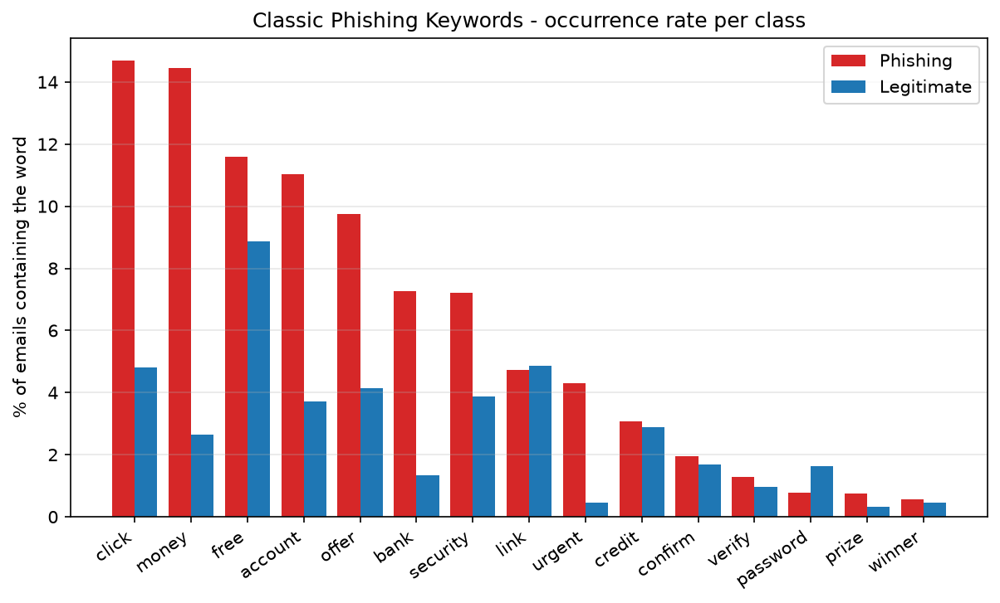
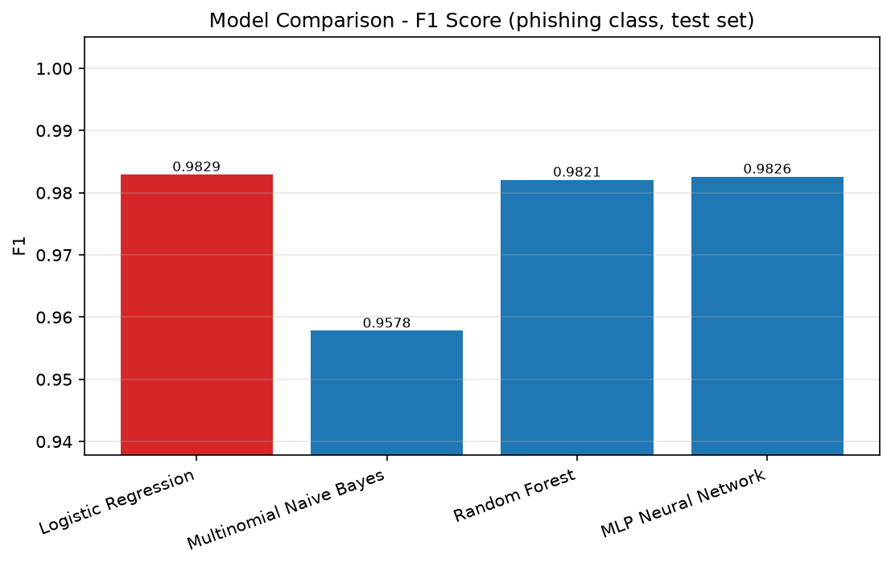
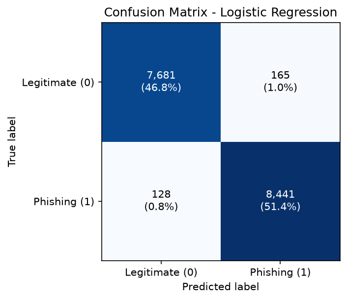
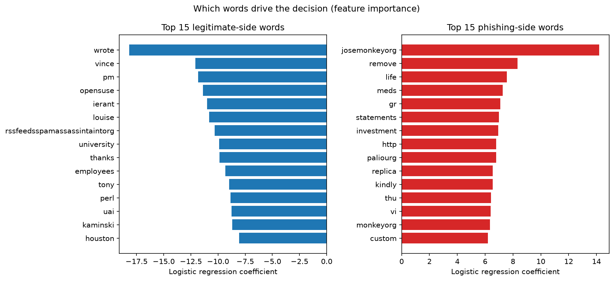
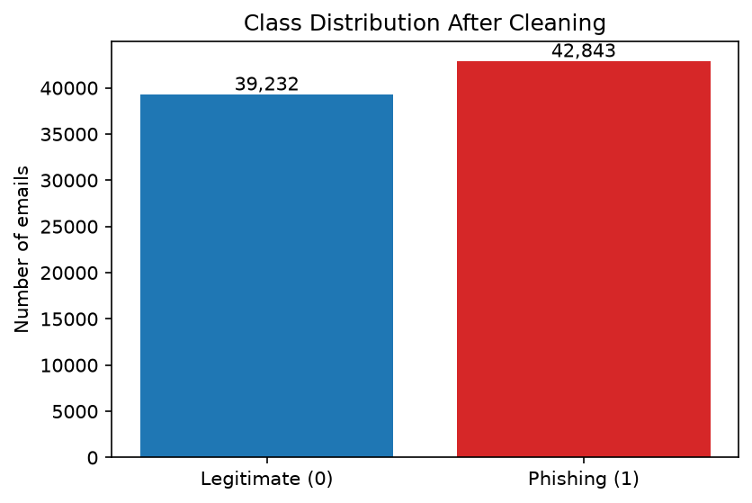
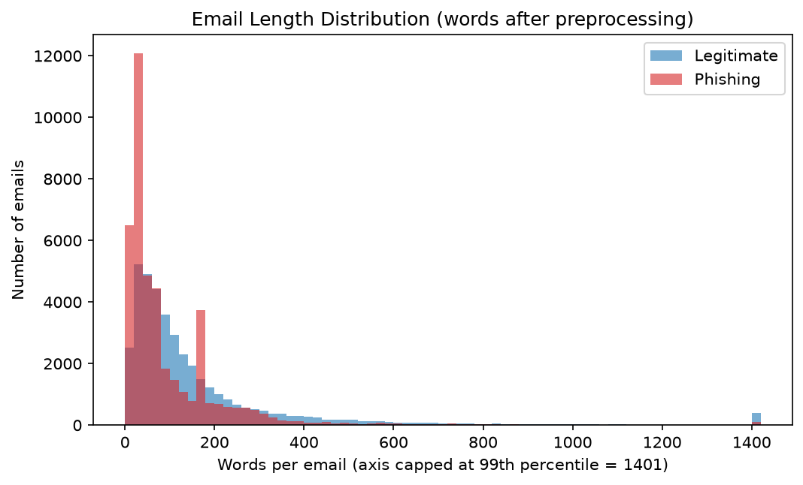
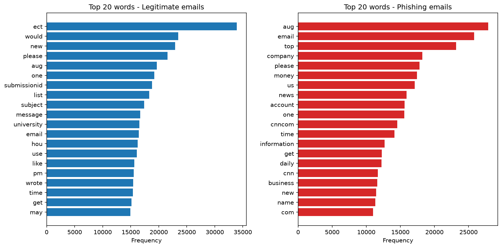
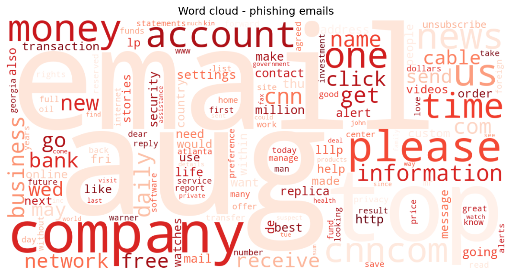

<div align="center">


# Phishing Email Detection with Machine Learning

**A leakage-aware NLP pipeline that catches 98.5% of phishing emails — and honestly reports what its score is made of.**


[Overview](#overview) · [Results](#model-comparison) · [Gallery](#graph-gallery) · [Install](#installation) · [Run](#how-to-run) · [Documents](#project-documents)

</div>

---

## Overview

Phishing is the most common way attacks enter an inbox, and benchmark corpora
make the detection task look nearly solved. This project builds the classifier
from scratch on **82,486 real emails** — and takes the harder second question
seriously: *how much of a near-perfect score is genuine phishing signal, and
how much is the model recognising which archive an email came from?*

Four classifiers required by the project brief are tuned and compared under
identical conditions. Tuned **Logistic Regression wins with 98.22% accuracy,
F1 0.9829 and recall 0.9851** — then the project reads the model's own
coefficients and names the dataset watermarks it found, which most write-ups
never mention.

Built as Project 2 of the IICT Summer Internship on AI & Machine Learning
(2026), VIT Chennai. Companion project: **Fake News Detection** (Project 1,
same engineering discipline, published separately).

## Features

- **Measure-before-trust cleaning** — the corpus's "pre-normalised" claim is
  verified empirically (0.0% uppercase, 0.0% HTML, yet 47.2% URL tokens), a
  quantified source watermark is removed (`enron`: 18.2% of ham vs 0.0% of
  phish), 4.28M-character outliers are truncated *before* deduplication, and
  a label-conflict check runs across the corpus.
- **Leakage-safe features** — stratified split first; vectorizers fitted on
  training text only; CountVectorizer vs TF-IDF decided by a pre-declared
  cross-validated protocol (it produced a statistical tie here and a decisive
  opposite winner in Project 1 — defaults are not measurements).
- **Scoped hyperparameter tuning** — grid search where it's cheap and moves
  the needle (LR `C`, NB `alpha`), fixed settings with written rationale
  where it isn't; the whole search is recorded in
  [`outputs/hyperparameter_tuning.csv`](outputs/hyperparameter_tuning.csv).
- **Recall-first evaluation** — accuracy, precision, recall, F1, one
  confusion matrix per model, and an error analysis of *which* phishing
  emails slip through (spoiler: the long ones).
- **Honest interpretability** — a coefficient-level feature-importance
  figure that separates genuine scam vocabulary from archive fingerprints.
- **One-command reproducibility** — `python main.py` regenerates every
  number, table, figure and model from the raw CSV at seed 42.

## Technologies Used

Python 3.10+ · pandas · NumPy · scikit-learn (LogisticRegression,
MultinomialNB, RandomForestClassifier, MLPClassifier, GridSearchCV,
TfidfVectorizer) · NLTK · Matplotlib · WordCloud · joblib · LaTeX (IEEEtran)
for the paper.

## Folder Structure

```
Phishing-Email-Detection/
├── assets/               banner + gallery images used by this README
├── dataset/
│   ├── raw/              put phishing_email.csv here (git-ignored)
│   └── processed/        clean_emails.csv generated here (git-ignored)
├── graphs/               all 16 generated figures
├── models/               best model + vectorizer + small model dumps
├── outputs/              evidence files: reports, tables, analyses
├── ieee_paper/           LaTeX source, figures, compiled 4-page PDF
├── report/               11-page project report (.docx + PDF)
├── presentation/         6-slide deck (.pptx + PDF) + speaker notes
├── src/                  modular pipeline (9 modules)
├── main.py               runs the whole pipeline end to end
├── requirements.txt
├── LICENSE · CHANGELOG.md · CONTRIBUTING.md · CODE_OF_CONDUCT.md
├── SECURITY.md · SUPPORT.md
└── README.md
```

## Dataset

**Not included in the repository** (≈107 MB). The project uses the public
combined phishing corpus distributed on Kaggle —
[Phishing Email Dataset](https://www.kaggle.com/datasets/naserabdullahalam/phishing-email-dataset)
— which aggregates legitimate mail from Enron-era mailboxes and public
mailing lists with phishing/scam messages from public archives
(`phishing_email.csv`: 82,486 rows, columns `text_combined`, `label`;
1 = phishing 42,891 · 0 = legitimate 39,595).

Setup: download `phishing_email.csv` and place it in
[`dataset/raw/`](dataset/raw/). The cleaned dataset
(`dataset/processed/clean_emails.csv`, ≈177 MB) and the two large model
dumps are generated locally and intentionally git-ignored.

## Installation

```bash
git clone https://github.com/<your-username>/Phishing-Email-Detection.git
cd Phishing-Email-Detection
python -m venv .venv && source .venv/bin/activate   # Windows: .venv\Scripts\activate
pip install -r requirements.txt
```

## Requirements

`pandas`, `numpy`, `matplotlib`, `scikit-learn`, `nltk`, `wordcloud`,
`joblib` (see [`requirements.txt`](requirements.txt)). Python 3.10+. The
NLTK stop-word list downloads automatically on first run.

## How to Run

```bash
python main.py
```

One command reproduces everything — cleaning, all EDA figures, the
vectorizer comparison, tuning, all four models, every metric and chart, and
the saved best model — in roughly **10–15 minutes** on a normal laptop.
All randomness is fixed at `random_state=42`.

Classify new text with the shipped trained model:

```python
import joblib
model = joblib.load("models/best_model.joblib")
vectorizer = joblib.load("models/tfidf_vectorizer.joblib")
model.predict(vectorizer.transform(["urgent verify your account click here"]))  # -> [1]
```

## Project Workflow

**Week 1 — Data understanding & cleaning** → **Week 2 — EDA & feature
engineering** → **Week 3 — Models, tuning & evaluation** → **Week 4 — IEEE
paper, report, presentation.** Every stage writes its evidence to
[`outputs/`](outputs/) so all documents quote executed numbers.

## Machine Learning Pipeline

`load & validate` → `inspect (evidence report)` → `truncate → dedupe →
conflict-check` → `normalise text (enron as stop word)` → `EDA (6 figures)`
→ `stratified 80/20 split` → `vectorizer protocol (Count vs TF-IDF)` →
`GridSearchCV tuning` → `train 4 models` → `evaluate (4 metrics + CM each)`
→ `select best by F1` → `feature importance` → `save model + vectorizer`.

## Dataset Cleaning Summary

| Step | Result |
|---|---|
| Verify pre-normalisation | 0.0% uppercase · 0.0% HTML · 47.2% URL tokens · 94.2% digits |
| Source watermark | `enron` in 18.2% of ham vs 0.0% of phish → stop word |
| Length outliers | max 4,279,526 chars → capped at 20,000 (255 emails, 0.31%) |
| Duplicates | 409 exact rows removed (truncation runs first, on purpose) |
| Label conflicts | 0 texts under both labels |
| Final corpus | **82,075 emails** (42,843 phish / 39,232 ham, 52.2% phishing) |

## EDA Summary

Legitimate mail runs longer (mean 168 words vs 103; medians 93 vs 48) with
heavy overlap — length can't separate the classes. The vocabularies can:
only **7 of the top-20 words are shared**. Fifteen classic scam keywords,
fixed *before* looking at the data, all occur more often in phishing
(`click`: 14.7% vs 4.8%; widest gap `money`: 14.4% vs 2.6%) — yet none is
universal, which is why the models use 5,000 word features instead of a
keyword rule. Full written observations:
[`outputs/eda_summary.txt`](outputs/eda_summary.txt).

## Feature Engineering Summary

Split first (65,660 train / 16,415 test, 52.2% phishing on both sides, seed
42); vectorizers fitted on training text only. CountVectorizer vs TF-IDF
under an identical cross-validated probe ended in a **statistical tie**
(F1 0.9805 vs 0.9801, gap 0.0003 — inside the pre-declared 0.001
threshold), so the declared tie rule selected **TF-IDF**. Details:
[`outputs/feature_engineering_notes.txt`](outputs/feature_engineering_notes.txt).

## Hyperparameter Tuning Summary

3-fold `GridSearchCV` on the training set, scored by phishing-class F1:
Logistic Regression `C` ∈ {0.1, 1, 10} → **10** (CV F1 0.9801 → **0.9827**);
Naive Bayes `alpha` ∈ {0.1, 0.5, 1.0} → **0.1** (CV F1 0.9605). The forest
stays at 100 trees and the MLP at one early-stopped hidden layer, with the
rationale documented in
[`src/model_training.py`](src/model_training.py) and the full search record
in [`outputs/hyperparameter_tuning.csv`](outputs/hyperparameter_tuning.csv).

## Model Comparison

All four models trained on identical TF-IDF matrices and the identical
stratified split. Precision/recall/F1 refer to the phishing class.

| Model | Accuracy | Precision | Recall | F1 |
|---|---|---|---|---|
| **Logistic Regression (C=10)** | **0.9822** | 0.9808 | **0.9851** | **0.9829** |
| MLP Neural Network | 0.9818 | 0.9803 | 0.9849 | 0.9826 |
| Random Forest | 0.9814 | 0.9850 | 0.9792 | 0.9821 |
| Multinomial Naive Bayes (α=0.1) | 0.9567 | 0.9743 | 0.9419 | 0.9578 |

## Best Model

**Tuned Logistic Regression** — selected automatically by highest F1, and it
also posts the highest recall, the metric that matters most here. On 16,415
held-out emails it makes **293 errors: 165 false alarms and 128 missed
phish** (≈15 misses per 1,000 phishing emails). The misses skew long —
missed phishing averages 180 words vs 104 for phishing overall — while
short, punchy scams are caught almost perfectly. The top three models sit
within 0.0008 F1 of each other: with vocabularies this disjoint, the linear
boundary is already near the ceiling, so extra capacity buys ~nothing at
100× the training cost. Naive Bayes's 498 missed phish (≈4× the winner's)
disqualify it despite its speed. Full reasoning and an honest caution about
corpus membership:
[`outputs/best_model_analysis.txt`](outputs/best_model_analysis.txt).

**The finding worth defending:** reading the winner's coefficients, the
single strongest phishing-side feature is `josemonkeyorg` — the hostname of
a public phishing archive — beside genuine scam words (`meds`, `replica`,
`kindly`); the ham side mixes real business signal with Enron first names
and a SpamAssassin collection token. The model is partly a phishing detector
and **partly an archive detector** — the correct lens for near-ceiling
scores on combined corpora, argued in full in the
[IEEE paper](ieee_paper/phishing_paper.pdf).

## Performance Metrics

Every model ships with accuracy, precision, recall, F1
([`outputs/model_comparison.csv`](outputs/model_comparison.csv)), a full
per-class classification report
([`outputs/classification_reports.txt`](outputs/classification_reports.txt)),
and an annotated confusion matrix in [`graphs/`](graphs/).

## Graph Gallery

| | |
|---|---|
|  |  |
| *15 classic scam words — all more frequent in phishing* | *Four models, one test set — best highlighted* |
|  |  |
| *Best model: 293 errors in 16,415* | *What the model actually learned — signal and watermarks* |
|  |  |
| *52.2% phishing after cleaning* | *Heavy overlap — words, not length, separate the classes* |
|  |  |
| *Only 7 of the top-20 words shared* | *Phishing vocabulary at a glance* |

All 16 figures (including the legitimate-class word cloud and the
per-metric comparison charts) live in [`graphs/`](graphs/).

## Project Outputs

Nine evidence files in [`outputs/`](outputs/) — inspection reports
(before/after cleaning), EDA observations, feature-engineering notes,
vectorizer comparison, tuning record, model comparison, classification
reports, and the best-model analysis. Every number in the documents traces
to one of these files.

## Project Documents

- 📄 **IEEE paper (4 pages, IEEEtran):**
  [`ieee_paper/phishing_paper.pdf`](ieee_paper/phishing_paper.pdf)
  (LaTeX source + figures included)
- 📝 **Project report (11 pages):**
  [`report/Phishing_Email_Detection_Project_Report.pdf`](report/Phishing_Email_Detection_Project_Report.pdf)
  ([.docx](report/Phishing_Email_Detection_Project_Report.docx))
- 🎤 **Presentation (6 slides + speaker notes):**
  [`presentation/Phishing_Email_Detection_Presentation.pdf`](presentation/Phishing_Email_Detection_Presentation.pdf)
  ([.pptx](presentation/Phishing_Email_Detection_Presentation.pptx),
  [speaker notes](presentation/speaker_notes.md))

## Future Improvements

Cross-archive evaluation (train and test on different sources) to measure
the archive-recognition share of the score; real URL and header features on
a corpus that preserves them; calibrated probabilities for
human-in-the-loop review; a small fine-tuned transformer under the same
leakage-controlled protocol; a Flask/Streamlit demo around the saved model.

## Reproducibility Note

Everything is seeded, so a rerun on the same environment reproduces
identical numbers. Across different library versions, tiny drifts (≤0.003)
in individual metrics are normal; the ranking, the best model, and every
conclusion are stable. The shipped `outputs/` files are the exact run all
documents were written from. The two large model dumps
(`random_forest.joblib`, `mlp_neural_network.joblib`) are git-ignored and
regenerate with `python main.py`.

## Acknowledgements

Developed during the IICT Summer Internship on AI & Machine Learning (2026)
under the mentorship of Dr. Ashok. Data credit: the public phishing email
corpus on Kaggle, building on the Enron corpus (Klimt & Yang, ECML 2004),
the Enron-Spam benchmarks (Metsis, Androutsopoulos & Paliouras, CEAS 2006),
and public phishing archives.

## License

Released under the [MIT License](LICENSE).
